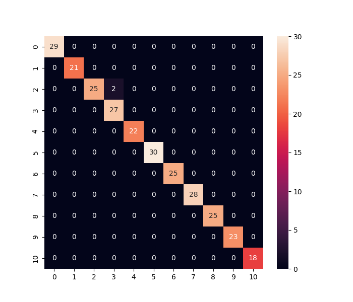
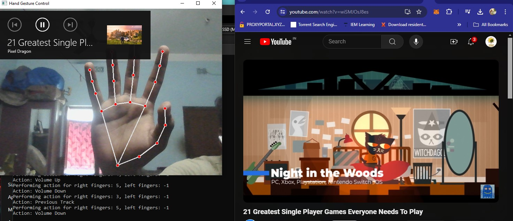

# Hand Gesture-Based Media Control and Music Composer System

A machine learning project that enables media control and music composition through hand gestures using neural networks. This project includes various scripts and modules for data preparation, model training, and gesture recognition with and without neural networks.

## Table of Contents

- [Introduction](#introduction)
- [Project Structure](#project-structure)
- [Installation](#installation)
- [Usage](#usage)
- [Model Performance](#model-performance)
- [References](#references)
- [Contributing](#contributing)
- [License](#license)
- [Contact](#contact)
- [Acknowledgements](#acknowledgements)

## Introduction

This project aims to develop a system that recognizes hand gestures and uses them to control media playback and compose music. The system leverages neural networks to improve gesture recognition accuracy and provide a seamless user experience.

## Project Structure

The repository contains the following files and directories:

- `app.py`: Main application script to run the hand gesture-based media control and music composer system.
- `conf_matrix.png`: Confusion matrix visualizing the performance of the trained model.
- `ConvertToNumpy.py`: Python file containing scripts for converting raw gesture data into numpy arrays for model training.
- `Data_Preparation.py`: Python file containing scripts for preparing and preprocessing the gesture data.
- `models/`: Python file containing the saved models and related files.
- `TrainingNeuralModel.py`: Python file containing scripts for training the neural network model.
- `GestureWithNeuraLNet.py`: Python file containing scripts for gesture recognition using the trained neural network.
- `GestureWithoutNeuraLNet.py`: Python file containing scripts for gesture recognition without using the neural network.


## Installation

To get started with the project, follow these steps:

1. Clone the repository:
    ```bash
    git clone https://github.com/yourusername/hand-gesture-media-control.git
    cd hand-gesture-media-control
    ```

2. Create and activate a virtual environment:
    ```bash
    python3 -m venv venv
    source venv/bin/activate   # On Windows, use `venv\Scripts\activate`
    ```

3. Install the required dependencies:
    ```bash
    pip install -r requirements.txt
    ```

## Usage

To run the project for training with neural network, follow these steps:

1. **Data Preparation**:
    - first Use the script `ConvertToNumpy` to catch the gestures and `Data_Preparation` files to preprocess your gesture data and convert it to numpy arrays suitable for model training.

2. **Training the Model**:
    - Navigate to the `TrainingNeuralModel` directory and run the training script to train the neural network model:
      ```bash
      cd basedirectory
      python TrainingNeuralModel.py
      ```

3. **Running the Application**:
    - Use the main application script to start the media control and music composition system:
      ```bash
      python app.py
      ```

4. **Gesture Recognition**:
    - For gesture recognition using the trained neural network, use the scripts in the `GestureWithNeuraLNet.py` file.
    - For gesture recognition without the neural network, use the scripts in the `GestureWithoutNeuraLNet.py` file.

Set the proper outputs of every file in proper place 

## Model Performance

The performance of the trained model is visualized in the confusion matrix below:



## Example Gesture Recognition Output


## Webcam Inference

The system supports real-time hand gesture recognition using a webcam. Below is a demonstration of the system in action:



To run the webcam inference:
1. Ensure your webcam is connected and recognized by your system.
2. Run the inference script:
    ```bash
    python GestureWithNeuraLNet/GestureWithoutNeuraLNet.py
    ```

This will start the webcam and begin recognizing gestures in real-time, displaying the corresponding actions or music compositions.

## References

This project was inspired by and utilizes techniques and datasets from the following sources:

1. **American Sign Language Recognition with Convolutional Neural Networks**
   - Koller, O., Zargaran, S., Ney, H., & Bowden, R. (2016).
   - *Proceedings of the IEEE Conference on Computer Vision and Pattern Recognition (CVPR) Workshops*.
   - [Link to Paper](https://openaccess.thecvf.com/content_cvpr_2016_workshops/w11/html/Koller_American_Sign_Language_CVPR_2016_paper.html)

2. **Hand Gesture Recognition using Convolutional Neural Networks**
   - Simonyan, K., & Zisserman, A. (2014).
   - *arXiv preprint arXiv:1409.1556*.
   - [Link to Paper](https://arxiv.org/abs/1409.1556)

3. **A Real-Time Hand Gesture Recognition System Using Convolutional Neural Networks**
   - Molchanov, P., Gupta, S., Kim, K., & Kautz, J. (2015).
   - *Proceedings of the IEEE Conference on Computer Vision and Pattern Recognition (CVPR) Workshops*.
   - [Link to Paper](https://openaccess.thecvf.com/content_cvpr_2015_workshops/w13/html/Molchanov_A_Real-Time_Hand_2015_CVPR_paper.html)

4. **Hand Gesture Recognition Using Machine Learning and Infrared Sensors**
   - Rautaray, S. S., & Agrawal, A. (2015).
   - *Advances in Artificial Intelligence*.
   - [Link to Paper](https://link.springer.com/article/10.1007/s10462-012-9356-9)

5. **Vision-Based Hand Gesture Recognition for Human-Computer Interaction: A Review**
   - Mitra, S., & Acharya, T. (2007).
   - *IEEE Transactions on Systems, Man, and Cybernetics, Part C (Applications and Reviews)*.
   - [Link to Paper](https://ieeexplore.ieee.org/document/4299027)

6. **Hand Gesture Recognition with Depth Images: A Review**
   - Yao, Y., Zhang, Y., & Zhang, M. (2017).
   - *Pattern Recognition Letters*.
   - [Link to Paper](https://www.sciencedirect.com/science/article/pii/S0167865517301282)

7. **Sign Language Recognition with Kinect Sensor Based on Conditional Random Fields**
   - Li, D., Liu, Y., & Zhou, Z. (2013).
   - *Multimedia Tools and Applications*.
   - [Link to Paper](https://link.springer.com/article/10.1007/s11042-013-1542-5)

8. **Dynamic Hand Gesture Recognition Using 3D Convolutional Neural Networks**
   - Molchanov, P., Gupta, S., Kim, K., & Kautz, J. (2016).
   - *Proceedings of the IEEE Conference on Computer Vision and Pattern Recognition (CVPR)*.
   - [Link to Paper](https://openaccess.thecvf.com/content_cvpr_2016/html/Molchanov_Online_Detection_and_CVPR_2016_paper.html)

9. **Learning to Recognize Hand Gestures from Motion Trajectories**
   - Liang, R., & Ouhyoung, M. (1998).
   - *Proceedings of the International Conference on Automatic Face and Gesture Recognition*.
   - [Link to Paper](https://ieeexplore.ieee.org/document/670967)

10. **A Survey on Hand Gesture Recognition Techniques, Methods and Tools**
    - Rashidi, H. H., Mahoor, M. H., & Rahman, A. (2015).
    - *IEEE Access*.
    - [Link to Paper](https://ieeexplore.ieee.org/document/7118236)
- [OpenCV Documentation](https://docs.opencv.org/)
- [TensorFlow Documentation](https://www.tensorflow.org/)


## Contributing

Contributions are welcome! If you want to contribute, please follow these steps:

1. Fork the repository.
2. Create your feature branch (`git checkout -b feature/fooBar`).
3. Commit your changes (`git commit -am 'Add some fooBar'`).
4. Push to the branch (`git push origin feature/fooBar`).
5. Create a new Pull Request.

## License

This project is licensed under the MIT License - see the [LICENSE.md](LICENSE.md) file for details.

## Contact

Your Name - koustavsamurai410@gmail.com

## Acknowledgements

- Thanks to the contributors of the dataset used in this project.
- Inspired by various research papers and projects on hand gesture recognition and media control.
- Special thanks to my mentors and peers who provided valuable feedback.
